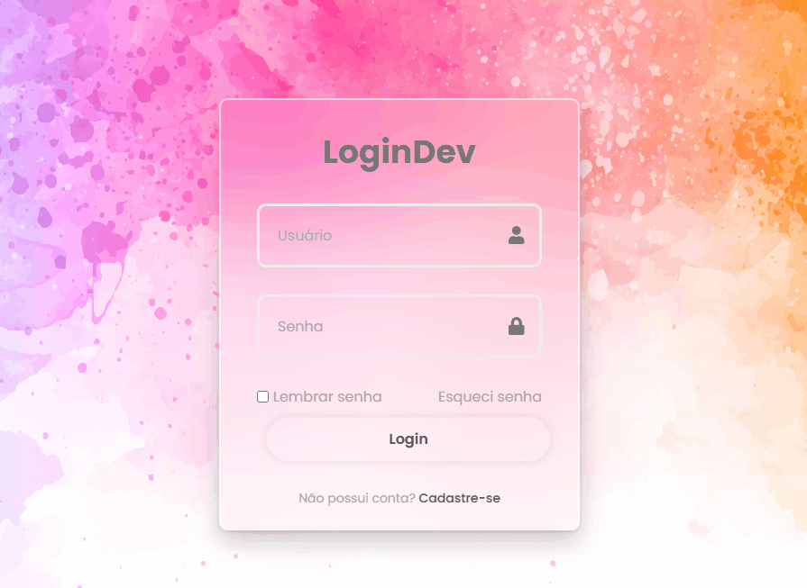
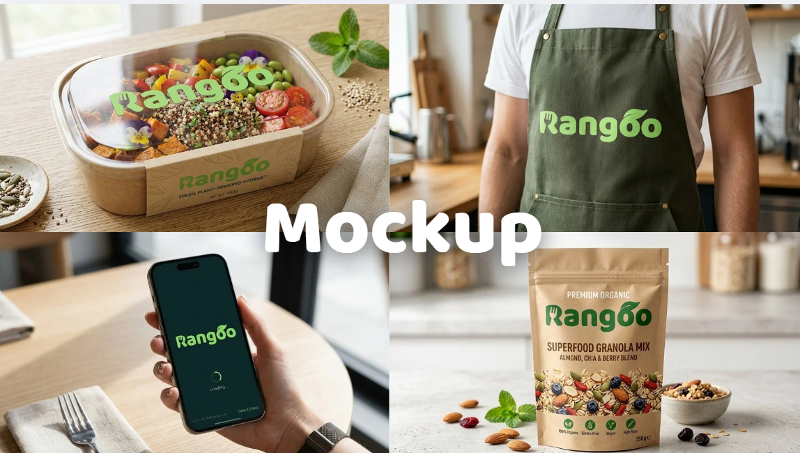
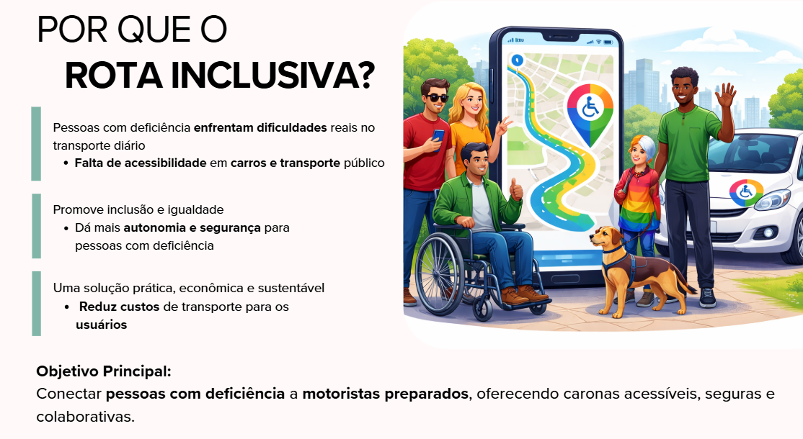

## Bem-vindo(a) ao perfil da Alice Tolosa 🌟

👩🏻‍💻 **`Desenvolvedora Full Stack | Node.js | React | APIs REST |`**

Me chamo Alice, tenho 29 anos e sou de São Paulo/SP. Antes da tecnologia, atuei na área de RH, onde desenvolvi habilidades como análise de dados, atenção aos detalhes e gestão de prazos, que hoje aplico no desenvolvimento de software.

Atualmente, faço parte do bootcamp da Generation Brasil focado em Desenvolvimento Web Full Stack com JavaScript, trabalhando com tecnologias como:
JavaScript | TypeScript | Node.js | NestJS | React | APIs REST | MySQL | HTML | CSS | Lógica de Programação | POO | Tailwind

Curso Análise e Desenvolvimento de Sistemas na Universidade São Judas Tadeu. Aqui você encontrará projetos de front-end e back-end, aplicando na prática os meus conhecimentos e compartilho minha evolução no meu LinkedIn. Sigo construindo minha carreira em tecnologia com dedicação e curiosidade.

---

### Linguagens e Tecnologias

| | | | | | | | |
| :---: | :---: | :---: | :---: | :---: | :---: | :---: | :---: |
|  |  |  |  |  |  |  |  |

 

---
### 📌 Projetos em Destaque 

🎬 **Carrossel Animado Dorama**  (Front-end)  
Tecnologias: JavaScript | HTML | CSS

Projeto pessoal com interface interativa exibindo meus doramas favoritos.

---

🔐 **Tela de Login** (Front-end)  
Tecnologias: JavaScript | HTML | CSS

Interface moderna de autenticação com foco em design e usabilidade.

---

🥗 **Rangoo** (Back-end)  
Tecnologias: NestJS | Node.js | TypeScript | MySQL | TypeORM | REST API | Swagger

API REST para plataforma de delivery de alimentos saudáveis, com gerenciamento de produtos e categorias.

---

🚗 **Rota Inclusiva** (Back-end) 
Tecnologias: NestJS | Node.js | TypeScript | MySQL | TypeORM | Swagger

API para aplicativo de carona compartilhada.

---

### 📫 Contato 

Fique à vontade para entrar em contato ou acompanhar minha jornada na área de tecnologia.

 
  
   
 
  

 
 
