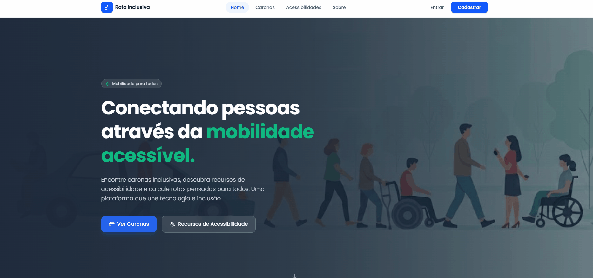

  

## 💜 Sobre mim

Oi! Eu sou a **Alice Oliveira Tolosa**, **Fullstack Developer**. Amo criar aplicações, principalmente aquelas que geram **impacto social**.

**Do RH para o Código:** Sim, essa bagagem foi um acelerador para o meu desenvolvimento na área tech.

Formação intensiva de mais de 400 horas pela Generation Brasil, com desenvolvimento de projetos Full Stack utilizando as seguintes tecnologias:

* **Backend:** Node.js, TypeScript, NestJS, APIs RESTful, Banco de Dados (MySQL) e TypeORM.
* **Frontend:** JavaScript, React, Tailwind CSS, HTML5, CSS3 e Axios.
* **Fundamentos:** Lógica de programação, Programação Orientada a Objetos (POO) e Git/GitHub.

---
## 🚀 Stacks

  

---

## 🐍 Snake Game 

  

---

## ⚛️ Meus Projetos Principais 

### `♿ Rota Inclusiva`

Aplicação Full Stack voltada para mobilidade urbana acessível, permitindo o cadastro e gerenciamento de caronas com diferentes categorias de acessibilidade. Desenvolvida com NestJS, React, TypeScript e MySQL.
 
`NestJS` | `Node.js` | `TypeScript` | `MySQL` | `TypeORM` `React` | `TypeScript` | `Vite` | `Tailwind CSS` | `React Router DOM`

> 🔗 **Deploy do Front-end:** [Ver projeto](https://rotainclusiva-react.vercel.app/)

 

---

### `🍽️ Rangoo`

Plataforma Full Stack para gerenciamento de restaurantes e pedidos online, permitindo o cadastro de produtos, categorias e operações de CRUD. Desenvolvida com React, TypeScript, NestJS e MySQL.
 
`NestJS` | `Node.js` | `TypeScript` | `MySQL` | `PostgreSQL` | `TypeORM` | `JWT` | `Swagger`|`React` | `TypeScript` | `Vite` | `Tailwind CSS` | `React Router DOM` | `Fetch API`
 
> 🔗 **Deploy do Front-end:** [Ver projeto](https://rangoo-react-acdp.vercel.app/)

 

--- 

### `💜 Meus Doramas`

Página web pessoal desenvolvida para organizar e compartilhar meus doramas favoritos, unindo minha paixão por histórias asiáticas com o aprendizado em desenvolvimento web. O projeto transforma uma lista de favoritos em uma experiência interativa e visual, utilizando um carrossel de séries com informações, avaliações e descrições.
 
`HTML5` | `CSS3` | `JavaScript` | `Responsive Design` | `Vanilla JS`

 

> 🔗 **Deploy do Front-end:** [Ver projeto](https://alicetolosa.github.io/meus_doramas/index.htm)

 
---

## 🌐 Vamos nos conectar?

---

  

